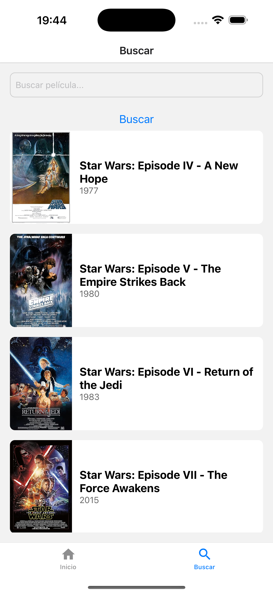

# Movie Finder App

Aplicación móvil de búsqueda de películas desarrollada con **React Native**, **Expo**, **TypeScript** y **Zustand**. La aplicación consume la API de [OMDb](http://www.omdbapi.com/) para listar y buscar películas.

---

## **Características Principales**

- **Pantalla de Inicio**: Muestra un listado de películas populares.
- **Pantalla de Búsqueda**: Permite buscar películas por título.
- **Pantalla de Detalles**: Muestra información detallada de una película seleccionada.
- **Navegación por Pestañas**: Implementa pestañas para "Inicio" y "Buscar".
- **Manejo de Errores**: Muestra mensajes claros en caso de errores (API no responde, sin conexión a Internet, etc.).
- **Responsive Design**: La aplicación se adapta a diferentes tamaños de pantalla.
- **Generación de APK**: Permite generar un APK para distribuir la aplicación.

---

## **Tecnologías Utilizadas**

- **React Native**: Framework para desarrollar aplicaciones móviles multiplataforma.
- **Expo**: Herramienta para simplificar el desarrollo y la construcción de aplicaciones React Native.
- **TypeScript**: Lenguaje de programación que añade tipos estáticos a JavaScript.
- **Zustand**: Librería para manejo de estados globales.
- **Axios**: Cliente HTTP para realizar llamadas a la API.
- **React Native Paper**: Librería de UI para componentes modernos y personalizables.
- **Expo Router**: Sistema de navegación para aplicaciones Expo.

---

## **Estructura del Proyecto**
movie-finder/  
├── app/  
│ ├── (tabs)/  
│ │ ├── _layout.tsx // Configuración de navegación por pestañas  
│ │ ├── index.tsx // Pantalla de inicio (listado de películas populares)  
│ │ └── search.tsx // Pantalla de búsqueda  
│ ├── movie/  
│ │ └── [id].tsx // Pantalla de detalles de la película  
│ └── _layout.tsx // Layout principal de la aplicación  
├── src/  
│ ├── store/  
│ │ └── useMovieStore.ts // Zustand store para manejar el estado de las películas  
│ ├── components/  
│ │ └── MovieCard.tsx // Componente reutilizable para mostrar una película  
│ ├── constants/  
│ │ └── api.ts // Constantes como la URL de la API y la API Key  
│ └── utils/  
│ └── errorHandler.ts // Manejo de errores  
├── package.json  
├── tsconfig.json  
└── README.md

---

## **Requerimientos Funcionales**

1. **Pantalla de Inicio**:
   - Muestra un listado de películas populares obtenidas de la API (término genérico como "Star").
   - Cada ítem del listado muestra:
     - Poster de la película.
     - Título.
     - Año.

2. **Pantalla de Búsqueda**:
   - Permite al usuario buscar películas ingresando un título.
   - Muestra los resultados en un listado con el mismo diseño que la pantalla de inicio.
   - Maneja estados como:
     - Cargando (mostrar un indicador).
     - Sin resultados (mostrar un mensaje apropiado).

3. **Pantalla de Detalle de Película**:
   - Muestra información detallada de la película seleccionada, incluyendo:
     - Poster.
     - Título.
     - Año.
     - Sinopsis (Plot).
     - Género (Genre).
     - Director.
   - Provee un botón para volver al listado anterior.

4. **Navegación**:
   - Implementa navegación por pestañas (tabs):
     - Tab 1: "Inicio" (listado de películas populares).
     - Tab 2: "Buscar" (pantalla de búsqueda).

5. **Manejo de Errores**:
   - Muestra mensajes de error claros cuando:
     - La API no responde.
     - No hay conexión a Internet.
     - Se intenta buscar con un campo vacío.

6. **Creación de APK**:
   - Genera un APK utilizando Expo.

---

## **Requerimientos Técnicos**

1. **Uso de Tecnologías**:
   - React Native con Expo.
   - TypeScript.
   - Axios para llamadas HTTP.
   - Zustand para manejo de estados globales.
   - React Native Paper para componentes de UI.
   - React Hook Form para manejo de formularios.

2. **Código Limpio**:
   - Componentes reutilizables y bien organizados.
   - Separación lógica del código (servicios, componentes, hooks, etc.).
   - Buenas prácticas de tipado en TypeScript.

3. **Responsive Design**:
   - La aplicación se adapta a diferentes tamaños de pantalla.

---

## **Configuración del Proyecto**

### **Prerrequisitos**

- Node.js (v16 o superior)
- Expo CLI (`npm install -g expo-cli`)
- Yarn o npm (recomendado Yarn)

### **Instalación**

1. Clona el repositorio:

   ```bash
   git clone https://github.com/tu-usuario/movie-finder.git
   cd movie-finder
   
---

## **Requerimientos Funcionales**

1. **Pantalla de Inicio**:
   - Muestra un listado de películas populares obtenidas de la API (término genérico como "Star").
   - Cada ítem del listado muestra:
     - Poster de la película.
     - Título.
     - Año.

2. **Pantalla de Búsqueda**:
   - Permite al usuario buscar películas ingresando un título.
   - Muestra los resultados en un listado con el mismo diseño que la pantalla de inicio.
   - Maneja estados como:
     - Cargando (mostrar un indicador).
     - Sin resultados (mostrar un mensaje apropiado).

3. **Pantalla de Detalle de Película**:
   - Muestra información detallada de la película seleccionada, incluyendo:
     - Poster.
     - Título.
     - Año.
     - Sinopsis (Plot).
     - Género (Genre).
     - Director.
   - Provee un botón para volver al listado anterior.

4. **Navegación**:
   - Implementa navegación por pestañas (tabs):
     - Tab 1: "Inicio" (listado de películas populares).
     - Tab 2: "Buscar" (pantalla de búsqueda).

5. **Manejo de Errores**:
   - Muestra mensajes de error claros cuando:
     - La API no responde.
     - No hay conexión a Internet.
     - Se intenta buscar con un campo vacío.

6. **Creación de APK**:
   - Genera un APK utilizando Expo.

---

## **Requerimientos Técnicos**

1. **Uso de Tecnologías**:
   - React Native con Expo.
   - TypeScript.
   - Axios para llamadas HTTP.
   - Zustand para manejo de estados globales.
   - React Native Paper para componentes de UI.
   - React Hook Form para manejo de formularios.

2. **Código Limpio**:
   - Componentes reutilizables y bien organizados.
   - Separación lógica del código (servicios, componentes, hooks, etc.).
   - Buenas prácticas de tipado en TypeScript.

3. **Responsive Design**:
   - La aplicación se adapta a diferentes tamaños de pantalla.

---

## **Configuración del Proyecto**

### **Prerrequisitos**

- Node.js (v16 o superior)
- Expo CLI (`npm install -g expo-cli`)
- npm

### **Instalación**

1. Clona el repositorio:

   ```
   git clone https://github.com/tu-usuario/movie-finder.git
   cd movie-finder
   
   2.  Instala las dependencias:
    
    terminal:
    
    npm install
    
3.  Configura la API Key de OMDb:
    
    -   Crea un archivo  `.env`  en la raíz del proyecto.
        
    -   Agrega tu API Key de OMDb:
        
        env
            
        `API_KEY=tu_api_key`
        
4.  Inicia el servidor de desarrollo:
    
  terminal
`expo start`
    
5.  Escanea el código QR con la aplicación  **Expo Go**  en tu dispositivo móvil o abre el simulador.
    

----------

## **Generación de APK**

Para generar un APK, ejecuta el siguiente comando:

terminal:

`expo build:android`

Sigue las instrucciones en la terminal para completar el proceso. Una vez que el APK esté listo, podrás descargarlo desde el panel de control de Expo.

----------

## **Capturas de Pantalla**

Pantalla de Inicio


Pantalla de Búsqueda



Pantalla de Detalles


----------

## **Descarga del archivo apk**

***link:***

`https://drive.google.com/file/d/1fKQPNg8MSsKyH3OUz-F9MuPbgdxoiB5m/view?usp=drive_link`

----------

## **Contribución**

Si deseas contribuir a este proyecto, sigue estos pasos:

1.  Haz un fork del repositorio.
    
2.  Crea una nueva rama (`git checkout -b feature/nueva-funcionalidad`).
    
3.  Realiza tus cambios y haz commit (`git commit -m 'Añade nueva funcionalidad'`).
    
4.  Haz push a la rama (`git push origin feature/nueva-funcionalidad`).
    
5.  Abre un Pull Request.
    

----------

## **Contacto**

Si tienes alguna pregunta o sugerencia, no dudes en contactarme:

-   **Nombre**: Daniel Ullauri
    
-   **Email**: [[ullauriochoadaniel@gmai.com](mailto:tu-email@example.com)]
    
-   **GitHub**:  [danielullauri93](https://github.com/tu-usuario)

